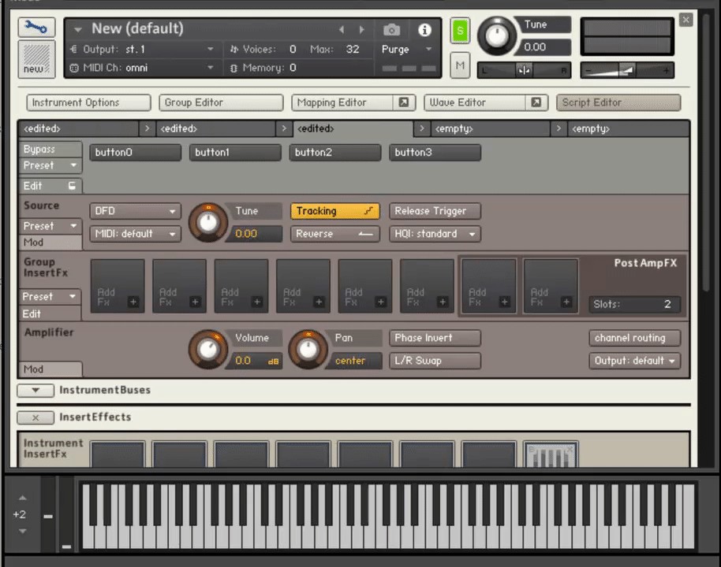

# KSP Multitasker
 
A user friendly way to create concurrent asynchronous routines in KSP (Kontakt Script Processor). A 'task' behaves somewhat like a function, except it will run asynchronously from the rest of the code in the parent callback. 

With a regular KSP function (whether 'called' or inline), the script will jump to the start of the function definition, run the code in the function, and then jump back to the place the function was called, and continue running the code in that callback. This means that if the function contains a 'wait', the parent callback will also be affected by the wait.

When a 'task' is called, the code inside the task will start running, but the parent callback will carry on running, even if there is a 'wait' inside the task.

## Usage

Download 'multitasker.ksp' and add it to your script directory. You can optionally download the example scripts to see it in action.

Using the multitasker is simple - add the following line to your init callback:

	multitasker.init()

To define a task, use the following syntax anywhere outside a callback:

	define_task(name, task_idx)
		// code goes here
	end_define

The 'task_idx' must be a unique number, starting from 0 and incrementing with each new task definition you create.

To call the task, simply use the task name as if it were a function:

	on note
		task_name() 
	end on

You can also pass arguments to the task. To do so, use this alternative task definition syntax:

	define_task_with_args(name, task_id, arg1, arg2, arg3)
		// code goes here
	end_define

Then, simply include the arguments when calling the task:

	on note
		task_name(30, EVENT_NOTE, some_variable)
	end on

The number of arguments must be exactly 3, and only integers can be passed through them. If you need less than 3, you can fill in the unused arguments with throwaway names.

Any variables you use inside a task definition should be polyphonic. This ensures they are kept 'thread safe', and won't be overwritten by any other concurrent tasks or callbacks.

Each instance of a task will have a unique EVENT_ID and NI_CALLBACK_ID, which is useful if you need to use commands such as stop_wait(). In effect, a task can be thought of as a custom callback.

It is recommended that you use the latest version of the SublimeKSP compiler (https://github.com/nojanath/SublimeKSP), and make sure 'Optimize Compiled Code' is enabled.

## Caveats
You are advised not to use the custom event par 'EVENT_PAR_0' for any note events in your main script, but if you must, make sure the value is always less than 20000000.

You can't call tasks from within other tasks. You also can't call tasks from the release callback.

Since the multitasker uses the release callback internally, you will need to use this pseudo-callback if you need to handle releases in your main script. 

	on_release

	end_on

## Example

	import "multitasker.ksp"

	on init
		declare ui_button button[4]
		multitasker.init()
	end on

	on note
		flash(200000, 0, EVENT_NOTE)
		flash(440000, 1, EVENT_NOTE)
		flash(1004700, 2, EVENT_NOTE)
		flash(2400000, 3, EVENT_NOTE)
	end on	

	define_task_with_args(flash,0, wait_time, button_to_flash, parent_note)
		while (KEY_DOWN[parent_note] = 1)
			button[button_to_flash] -> value := 1
			wait(wait_time)
			button[button_to_flash] -> value := 0
			wait(wait_time)
		end while
	end_define

